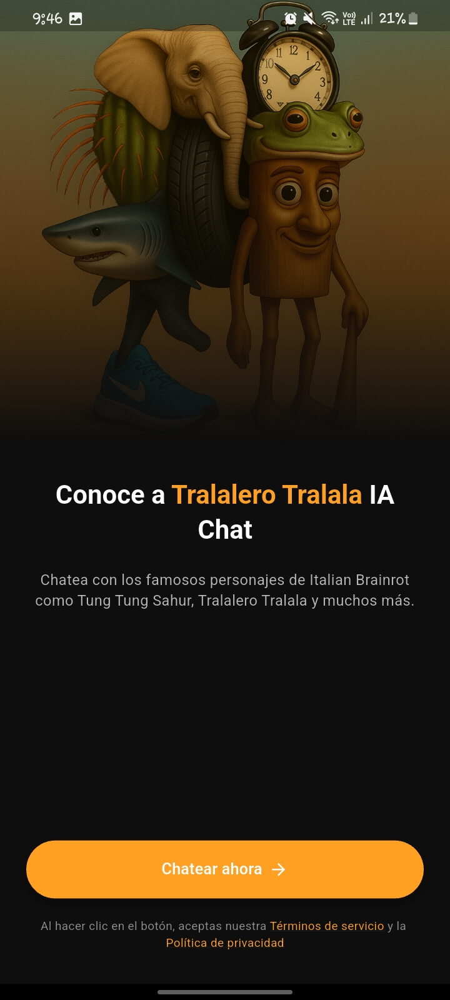
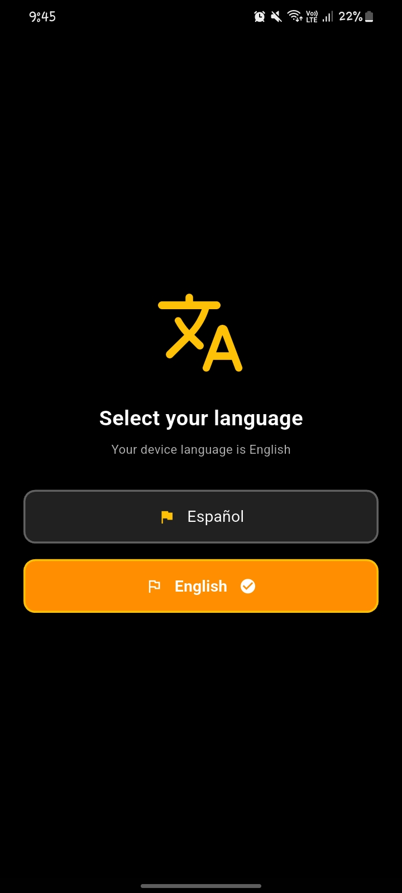
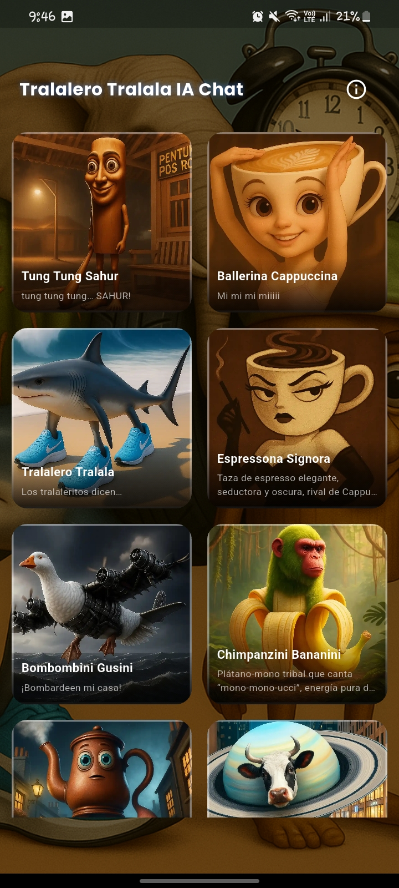
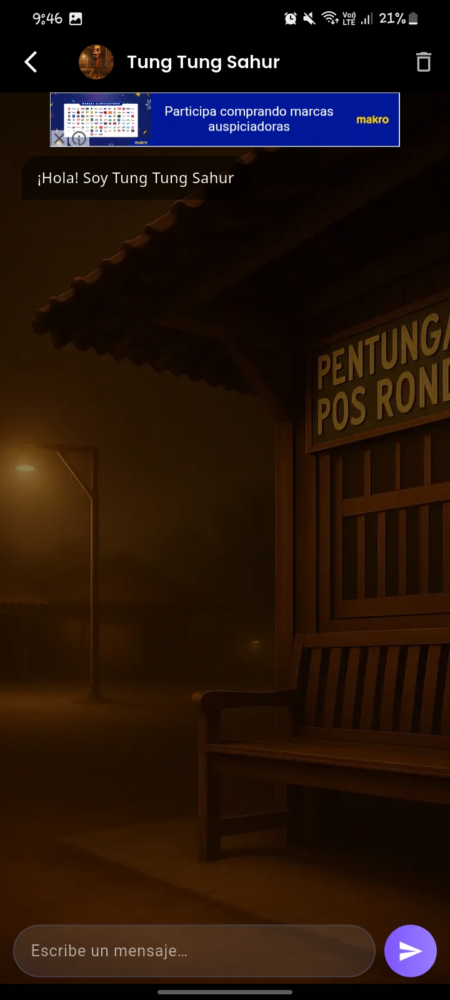
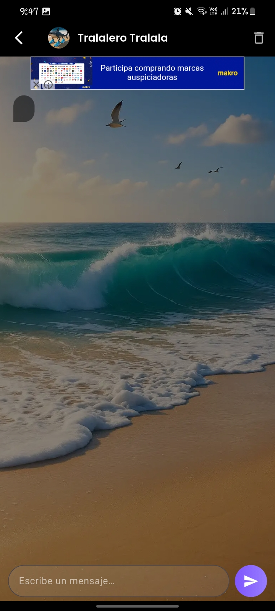
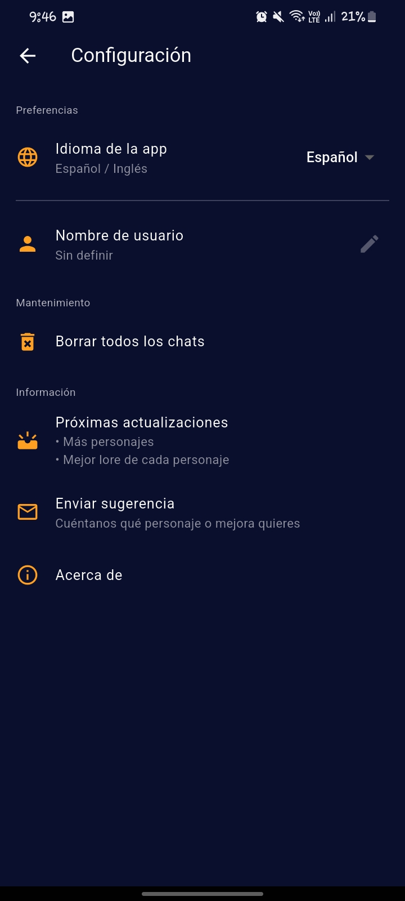

# 🤖 Tralalero Chat IA — App Android (versión pública solo-demo)

> **Tralalero Chat IA** es una aplicación móvil que te permite chatear con los personajes más caóticos del _Italian Brainrot_.  
> Este repositorio **NO contiene el código fuente**: solo incluye capturas de pantalla y una descripción técnica/funcional para fines de portafolio.  
> La versión completa está publicada en Google Play y se distribuye de forma gratuita.

  

---

## ✨ Funciones principales

| Función | Descripción |
|---------|-------------|
| **Chat sin registro** | El usuario entra, elige un personaje y empieza a hablar – sin cuentas ni permisos especiales. |
| **Personajes alojados en Firebase** | Todos los datos (nombre, imagen, lore, prompts) viven en Cloud Firestore, lo que permite actualizarlos sin publicar una nueva versión. |
| **Selector de idioma** | Cambia entre Español (<code>es-419</code>) e Inglés (en) desde Ajustes; la UI, las descripciones y el _welcome message_ se traducen al vuelo. |
| **Publicidad no invasiva** | Banner AdMob en la parte inferior y un interstitial cada 3 mensajes del usuario. |
| **Borrado de chats** | El historial se guarda localmente con _SharedPreferences_ y puede limpiarse desde Ajustes o en la pantalla de chat. |

---

## 📲 Pila tecnológica

| Capa | Tecnología |
|------|------------|
| **Framework** | Flutter 3.22 (Dart 3) |
| **Backend-less** | Firebase (Cloud Firestore) |
| **Ads** | Google AdMob |
---

## 📸 Galería de capturas

| # | Pantalla | Archivo |
|---|----------|---------|
| 1 | *Splash / Intro* | `screenshots/intro.jpg` |
| 2 | Selector de idioma | `screenshots/selector_idioma.jpg` |
| 3 | Selector de nombre | `screenshots/selector_nombre.jpg` |
| 4 | Home (grid de personajes – parte 1) | `screenshots/personajes1.jpg` |
| 5 | Home (grid de personajes – parte 2) | `screenshots/personajes2.jpg` |
| 6 | Chat (bienvenida, banner AdMob) | `screenshots/chat1.jpg` |
| 7 | Chat (otro personaje) | `screenshots/chat2.jpg` |
| 8 | Ajustes | `screenshots/ajustes.jpg` |

VER capturas

---

---

---

---

---

---

---

---

## 📥 APK / Play Store

| Canal | Enlace |
|-------|--------|
| **Google Play (prod)** | <https://play.google.com/store/apps/details?id=com.hlc.brainrootiachat> |

---

## 📧 Contacto y sugerencias

| Campo | Información |
|-------|-------------|
| **Autor** | Henry Luis Callupe Ancco |
| **E-mail** | <henrydevops6@gmail.com> |
| **LinkedIn** | [linkedin.com/in/henrycallupeancco](https://www.linkedin.com/in/henrycallupeancco/) |

> ¿Quieres proponer un nuevo personaje o mejora?  
> Envíame un correo con el asunto **“Sugerencia Tralalero Chat IA”** y lo revisaré para la siguiente versión.

---

## ⚠️ Licencia

Este repositorio se publica únicamente con fines de exhibición.  
**No** incluye código fuente, assets originales ni claves de producción.  
Queda prohibida la redistribución del APK fuera de Google Play.
